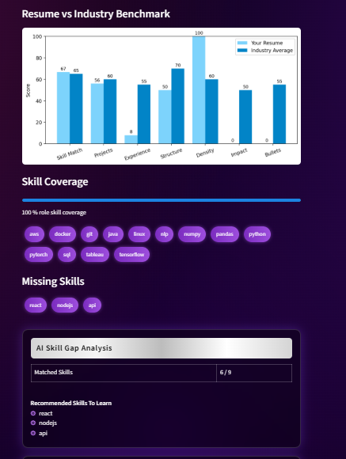
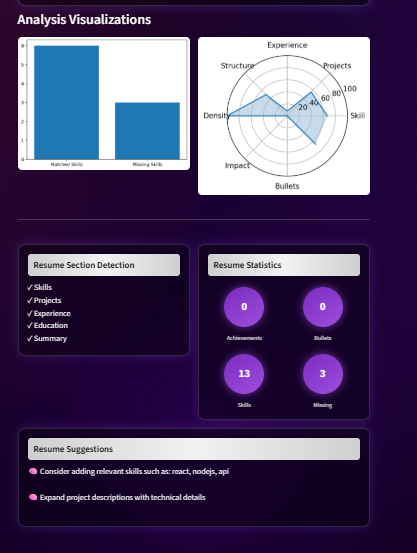

# BMSCE-XCEL-TS100
BMSCE XCEL COE Hackathon

# GenAI Resume Analyzer & Candidate Ranking System

## 📌 Overview

GenAI Resume Analyzer is an AI-powered recruitment assistant designed to evaluate resumes against a given Job Description (JD), generate ATS-style scores, identify skill gaps, provide personalized recommendations, and rank multiple candidates based on their suitability for a role.

The system combines NLP, Semantic Similarity Models, ATS Scoring Logic, and Generative AI to simulate a modern intelligent recruitment workflow.

---

## 🚀 Key Features

### Resume Analysis
- Upload Resume (PDF)
- Enter/Paste Job Description
- Automatic Resume Parsing
- ATS Compatibility Score
- Skill Gap Detection
- Resume Quality Evaluation
- Career Recommendations

### AI-Powered Evaluation
- Semantic Resume ↔ JD Matching
- Detailed AI Review
- Strength Analysis
- Weakness Analysis
- Improvement Suggestions
- Personalized Learning Recommendations

### Visual Analytics
- ATS Score Dashboard
- Skill Coverage Meter
- Resume vs Industry Benchmark Comparison
- Radar Chart Analysis
- Resume Statistics Dashboard

### Candidate Ranking System
- Upload Multiple Resumes
- Automatic Candidate Scoring
- Sort Candidates by Eligibility
- Display Most Suitable Candidates
- Display Least Suitable Candidates
- AI-Assisted Shortlisting

---

## 🧠 AI & NLP Components

### NLP Processing
Used for:

- Resume Parsing
- Skill Extraction
- Section Detection
- Keyword Analysis
- Job Role Mapping

Libraries:

- spaCy
- NLTK (optional preprocessing)

---

### Semantic Similarity

Uses transformer-based embeddings to understand contextual similarity between:

```text
Resume
     ↔
Job Description
```

Model:

- Sentence Transformers
- all-MiniLM-L6-v2

Benefits:

- Understands meaning instead of exact keyword matching
- More accurate than traditional ATS systems

---

### Generative AI

Local LLM integration using:

- Ollama
- Mistral 7B

Used for:

- Recruiter-style Resume Review
- Personalized Suggestions
- Career Advice
- Skill Improvement Guidance

---

## 🏗 System Architecture

```text
                ┌───────────────────┐
                │   Resume PDF      │
                └─────────┬─────────┘
                          │
                          ▼
                ┌───────────────────┐
                │ Resume Parser     │
                │ (PyPDF)           │
                └─────────┬─────────┘
                          │
                          ▼
                ┌───────────────────┐
                │ NLP Processing    │
                │ spaCy             │
                └─────────┬─────────┘
                          │
      ┌───────────────────┼───────────────────┐
      ▼                   ▼                   ▼

 Skill Extraction   Section Detection   Resume Metrics

      ▼
      ▼
Semantic Embeddings
(Sentence Transformers)

      ▼

ATS Scoring Engine

      ▼

Skill Gap Analysis

      ▼

LLM Analysis
(Mistral via Ollama)

      ▼

Dashboard & Visualizations
(Streamlit)
```

---

## 🛠 Tech Stack

### Frontend

- Streamlit

### Backend

- Python

### NLP

- spaCy
- NLTK

### AI / ML

- Sentence Transformers
- Scikit-Learn

### GenAI

- Ollama
- Mistral 7B

### Data Processing

- NumPy
- Pandas

### Visualization

- Matplotlib
- Plotly

### PDF Processing

- PyPDF

---

## 📂 Project Structure

```text
GenAI-Resume-Analyzer/
│
├── app.py
│
├── data/
│   ├── skills.json
│   └── job_roles.json
│
├── utils/
│   ├── parser.py
│   ├── analyzer.py
│   ├── scorer.py
│   ├── suggestions.py
│   ├── resume_quality.py
│   ├── impact_analyzer.py
│   ├── bullet_analyzer.py
│   ├── section_classifier.py
│   ├── skill_gap.py
│   ├── job_recommender.py
│   ├── candidate_ranker.py
│   └── llm_analysis.py
│
├── screenshots/
│   ├── SS1.png
│   └── SS2.png
│
├── requirements.txt
│
└── README.md
```

---

## 📸 Screenshots

### Analytics



---

### Recommendations



---

## ⚙ Installation

### Clone Repository

```bash
git clone https://github.com/yourusername/genai-resume-analyzer.git

cd genai-resume-analyzer
```

---

### Create Virtual Environment

```bash
python -m venv venv
```

Activate:

Windows

```bash
venv\Scripts\activate
```

Linux/Mac

```bash
source venv/bin/activate
```

---

### Install Dependencies

```bash
pip install -r requirements.txt
```

---

### Download NLP Models

```bash
python -m spacy download en_core_web_sm
```

---

### Install Ollama (Optional GenAI Feature)

Download:

https://ollama.com/download

Run:

```bash
ollama run mistral
```

---

## ▶ Running the Project

Start Streamlit Application:

```bash
streamlit run app.py
```

Open browser:

```text
http://localhost:8501
```

---

## 📈 ATS Score Calculation

The ATS score is computed using a weighted scoring system:

```text
ATS Score =

35% Skill Match
15% Projects
15% Experience
10% Resume Structure
10% Skill Density
10% Impact Metrics
5% Bullet Quality
```

---

## 🎯 Candidate Ranking Workflow

```text
Upload Multiple Resumes
            │
            ▼

Extract Skills & Features
            │
            ▼

Compare with Job Description
            │
            ▼

Calculate ATS Scores
            │
            ▼

Rank Candidates
            │
            ▼

Display:
Top Candidates
Bottom Candidates
```

---

## 🔮 Future Enhancements

- Resume Rewrite Generator
- Interview Question Generator
- Resume Chatbot
- LinkedIn Profile Analyzer
- Job Recommendation Engine
- Multi-JD Comparison
- Cloud Deployment
- Recruiter Analytics Dashboard

---

## 👥 Team Contributions

### NLP & Resume Parsing
- Skill Extraction
- Section Classification
- Resume Quality Analysis

### ATS Engine
- Scoring Algorithm
- Benchmark Comparison
- Candidate Ranking

### GenAI Module
- LLM Integration
- AI Review Generation
- Career Recommendations

### Dashboard & UI
- Streamlit Interface
- Visual Analytics
- Candidate Ranking Dashboard

---

## 📜 License

This project was developed for academic and hackathon purposes.
